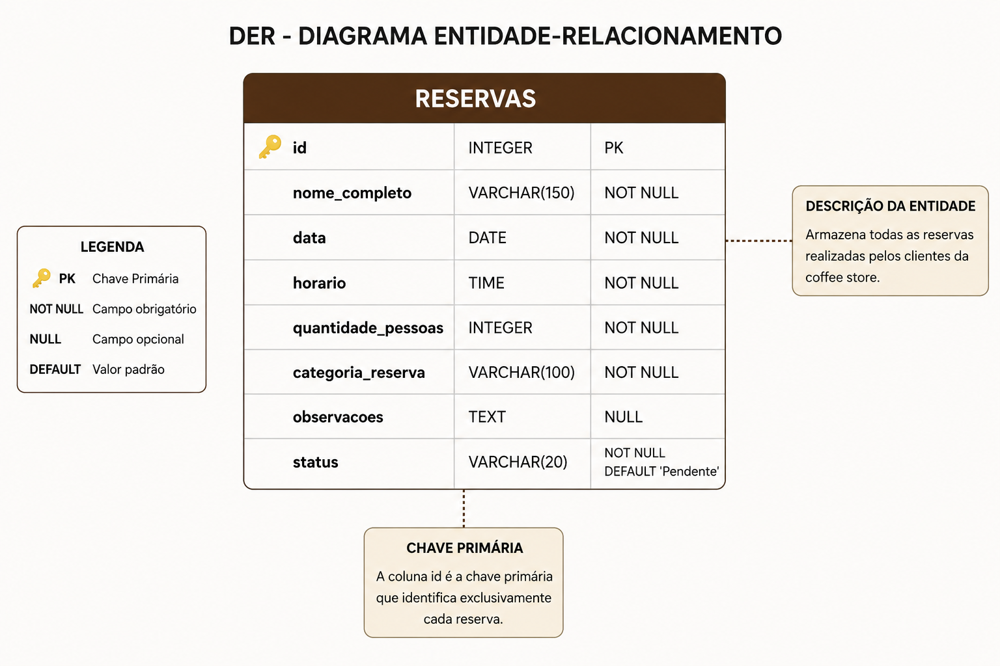

# ☕ Café & Sabor — Sistema de Reservas

Sistema web desenvolvido para uma atividade acadêmica com o objetivo de simular o processo de reserva de mesas em uma cafeteria.

O projeto utiliza **Python com Flask** no backend e **HTML e CSS** no frontend, seguindo uma **arquitetura monolítica**.

---

## 📌 Sobre o projeto

O sistema permite que o usuário:

* Acesse a página inicial da cafeteria;
* Acesse a página de reservas;
* Preencha seus dados;
* Informe a data e o horário da reserva;
* Informe a quantidade de pessoas;
* Adicione uma observação, caso necessário;
* Envie a reserva através de um formulário `POST`;
* Visualize uma tela de confirmação com os dados informados;
* Visualize a lista de reservas cadastradas;
* Pesquise reservas pelo nome;
* Altere o status das reservas cadastradas.

---

## 🎯 Objetivo

Desenvolver uma aplicação web simples aplicando conceitos de:

* Desenvolvimento Web;
* Backend com Flask;
* Rotas;
* Formulários HTML;
* Método HTTP `POST`;
* Método HTTP `GET`;
* Recebimento e processamento de dados;
* Templates;
* Validação de dados;
* Métricas calculadas dinamicamente;
* Manipulação de estados;
* Pesquisa e filtragem de dados;
* Arquitetura Monolítica;
* Git e GitHub.

---

## 🛠️ Tecnologias utilizadas

### Backend

* Python
* Flask

### Frontend

* HTML5
* CSS3

### Ferramentas

* Git
* GitHub
* Visual Studio Code

---

## 🏗️ Arquitetura

O projeto utiliza uma **arquitetura monolítica**, na qual os componentes da aplicação estão concentrados em um único projeto.

O Flask é responsável por:

* Gerenciar as rotas;
* Servir as páginas HTML;
* Receber os dados do formulário;
* Processar os dados enviados;
* Exibir a confirmação da reserva.

### Fluxo principal

```text
Usuário
   │
   ▼
Página Inicial
   │
   ▼
Página de Reserva
   │
   │ POST
   ▼
Flask / app.py
   │
   ▼
Processamento dos dados
   │
   ▼
Validação dos dados
   │
   ├── Dados inválidos
   │
   │       ▼
   │
   │   Mensagem de erro
   │
   └── Dados válidos
           │
           ▼
   Cadastro da reserva
           │
           ▼
   Tela de Confirmação
           │
           ▼
   Lista de Reservas
           │
           ├── Pesquisa
           │
           └── Alteração de Status
```

---

## 🚀 Funcionalidades

### Página inicial

Apresenta informações sobre a cafeteria e disponibiliza acesso à página de reservas.

A página inicial também apresenta métricas calculadas dinamicamente pelo sistema:

* Total de reservas;
* Reservas confirmadas;
* Total de pessoas.

### Reserva

O usuário pode informar:

* Nome completo;
* Data da reserva;
* Horário;
* Número de pessoas;
* Observações.

### Confirmação

Após o envio do formulário, o sistema apresenta os dados informados pelo usuário em uma tela de confirmação.

### Validações

O sistema realiza validações dos dados antes de salvar uma reserva.

São verificadas as seguintes situações:

* Campos obrigatórios vazios;
* Nome inválido;
* Número de pessoas não numérico;
* Número de pessoas igual ou menor que zero;
* Número de pessoas acima de 20.

Caso algum dado seja inválido, a reserva não é cadastrada e uma mensagem de erro é apresentada ao usuário.

### Métricas

O sistema calcula dinamicamente três métricas a partir das reservas cadastradas:

* Total de reservas;
* Reservas confirmadas;
* Total de pessoas.

Essas métricas são apresentadas na página inicial e são atualizadas conforme novas reservas são cadastradas.

### Lista de Reservas

O sistema possui uma página para visualizar as reservas cadastradas.

A lista apresenta informações como:

* ID;
* Nome;
* Data;
* Horário;
* Número de pessoas;
* Status.

### Pesquisa

A lista de reservas possui uma ferramenta de pesquisa que permite localizar uma reserva pelo nome do cliente.

A pesquisa utiliza o método HTTP `GET`.

### Alteração de Status

Cada reserva possui um status.

Ao ser cadastrada, a reserva recebe inicialmente o status:

**Confirmada**

O botão **Mudar Status** permite alterar o status da reserva para:

**Concluída**

A alteração do status não exclui a reserva do sistema.

---

## 📂 Estrutura do projeto

```text
coffee-store/
│
├── app.py
├── requirements.txt
├── .gitignore
├── README.md
│
├── templates/
│   ├── index.html
│   ├── reserva.html
│   ├── confirmacao.html
│   └── lista_reservas.html
│
├── static/
│   └── style.css
│
└── docs/
    ├── der.jpeg
    └── arquitetura_sistema.jpeg
```

---

## ⚙️ Como executar o projeto

### 1. Clonar o repositório

```bash
git clone https://github.com/douglassud21/coffee-store.git
```

Entre na pasta:

```bash
cd coffee-store
```

### 2. Criar um ambiente virtual

No Windows:

```bash
python -m venv venv
```

Ative o ambiente virtual:

```bash
venv\Scripts\activate
```

### 3. Instalar as dependências

```bash
pip install -r requirements.txt
```

### 4. Executar a aplicação

```bash
python app.py
```

### 5. Acessar no navegador

```text
http://127.0.0.1:5000/
```

---

## 🔄 Rotas do sistema

| Método | Rota                 | Função                                    |
| ------ | -------------------- | ----------------------------------------- |
| GET    | `/`                  | Página inicial                            |
| GET    | `/reserva`           | Formulário de reserva                     |
| POST   | `/confirmacao`       | Recebe os dados e apresenta a confirmação |
| GET    | `/reservas`          | Lista e pesquisa as reservas              |
| POST   | `/mudar-status/<id>` | Altera o status da reserva                |

---

## 📤 Envio dos dados

O formulário de reserva utiliza o método HTTP `POST`.

Exemplo:

```html
<form action="/confirmacao" method="POST">
```

Os dados são recebidos no Flask através de:

```python
nome = request.form.get("nome")

data = request.form.get("data")

horario = request.form.get("horario")

pessoas = request.form.get("pessoas")

observacao = request.form.get("observacao")
```

Após o processamento, os dados são enviados para a página de confirmação.

---

## 🛡️ Validações

Antes de salvar uma reserva, o sistema realiza validações dos dados recebidos.

Os campos obrigatórios são verificados para garantir que não estejam vazios.

O número de pessoas também é validado para garantir que:

* Seja um valor numérico;
* Seja maior que zero;
* Não ultrapasse o limite de 20 pessoas.

O nome também é validado para garantir que seja informado corretamente.

Quando uma informação inválida é identificada, o sistema impede o cadastro e apresenta uma mensagem de erro amigável ao usuário.

Exemplos de valores inválidos:

```text
Pessoas: 0
```

```text
Pessoas: -1
```

```text
Pessoas: abc
```

---

## 📊 Métricas

As métricas apresentadas na página inicial são calculadas dinamicamente pelo Python utilizando as reservas armazenadas em memória.

Exemplo:

```python
total_reservas = len(reservas)

reservas_confirmadas = sum(
    1 for reserva in reservas
    if reserva["status"] == "Confirmada"
)

total_pessoas = sum(
    reserva["pessoas"] for reserva in reservas
)
```

As informações são enviadas para o template da página inicial e apresentadas nos cards do dashboard.

---

## 🔄 Manipulação de estados

Cada reserva possui um status.

O status inicial de uma nova reserva é:

```python
"status": "Confirmada"
```

Através da página de lista de reservas, o usuário pode utilizar o botão **Mudar Status**.

O sistema altera o status sem excluir a reserva.

Exemplo:

```python
if reserva["status"] == "Confirmada":
    reserva["status"] = "Concluída"
else:
    reserva["status"] = "Confirmada"
```

---

## 🔎 Pesquisa e filtragem

A página `/reservas` permite realizar pesquisas utilizando o método HTTP `GET`.

Exemplo:

```text
/reservas?busca=douglas
```

O sistema verifica o nome das reservas cadastradas e apresenta somente os resultados correspondentes à pesquisa.

---

## 🧪 Testes

Para testar o sistema:

1. Acesse a página inicial;
2. Clique em **Fazer uma reserva**;
3. Preencha todos os campos obrigatórios;
4. Clique em **Confirmar reserva**;
5. Verifique se a página de confirmação apresenta corretamente os dados informados.
6. Acesse a página de **Lista de Reservas**;
7. Verifique se a reserva cadastrada aparece na lista;
8. Utilize a pesquisa pelo nome;
9. Utilize o botão **Mudar Status**;
10. Verifique se o status da reserva foi alterado;
11. Retorne à página inicial e verifique se as métricas foram atualizadas.

### Cenário esperado

```text
Nome: Douglas Nascimento
Data: 20/08/2026
Horário: 19:00
Pessoas: 4
Observação: Mesa próxima à janela
```

O sistema deve apresentar essas informações na tela de confirmação.

### Testes de validação

Também foram realizados testes com valores inválidos.

Exemplo:

```text
Pessoas: 0
```

O sistema deve impedir o cadastro e apresentar uma mensagem informando que o número de pessoas deve ser maior que zero.

Outro teste:

```text
Pessoas: -1
```

O sistema também deve impedir o cadastro.

Também é realizado o teste com um valor não numérico:

```text
Pessoas: abc
```

Nesse caso, o sistema deve informar que o número de pessoas precisa ser um valor válido.

---

## 📐 Documentação

### Diagrama Entidade-Relacionamento (DER)

O DER representa a estrutura do banco de dados e o relacionamento entre suas entidades.



### Arquitetura do Sistema

O diagrama de arquitetura apresenta a organização e o fluxo dos principais componentes do sistema.


---

## 👥 Equipe

| Integrante                  |    RM | Responsabilidade                                                            |
| --------------------------- | ----: | --------------------------------------------------------------------------- |
| Douglas Silva Nascimento    | 22873 | Backend, Flask, rotas, formulário POST, recebimento dos dados e confirmação |
| Allan Gabriel Sousa Palma   | 22544 | HTML, CSS e navegação entre páginas                                         |
| Vitória de Carvalho Esteves | 21684 | Arquitetura monolítica, diagrama, evento principal e reações automatizadas  |
| Gustavo Gomes Pecora        | 22767 | GitHub, documentação, DER, testes e organização da apresentação             |

---

## 📚 Projeto acadêmico

Projeto desenvolvido como atividade acadêmica para aplicação prática dos conceitos de desenvolvimento web, arquitetura de software, Git/GitHub e integração entre frontend e backend.

---

**☕ Café & Sabor — Sistema de Reservas**
